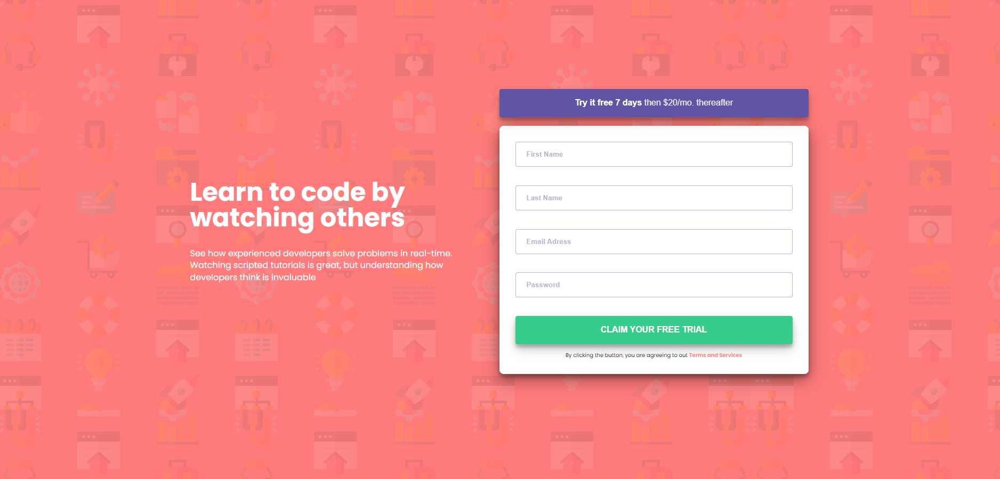

# Challanges FrontEnd Mentor

en: The current repository aims to fulfill the challenges of the [frontend mentor](https://www.frontendmentor.io/challenges) site.

pt-br: O repositório atual tem como objetivo realizar os desafios do site [frontend mentor](https://www.frontendmentor.io/challenges).

## Day 01 

Only HTML and CSS

  
  

## Day 02

React, TypeScript, SASS, GitHub API.

  
  

## Day 03

Only HTML and CSS

  
  

## Day 04

Only HTML and CSS

  
  

## Day 05

Only HTML and CSS

  
  

## Day 06

Only HTML and CSS

  
  

## Day 07

React, SASS

  
  <!--  -->

## Day 08

React, TypeScript, SASS, GitHub API.

  
  <!--  -->

## Day 09

Only HTML and CSS

  
  

## Day 10

React, TypeScript, SASS.

  
  

## Day 11

React, TypeScript, SASS.

  
  

## Day 12

React, TypeScript, SASS.

  
  
  

## Day 13

Only HTML and CSS.

  
  

## Day 14

React, TypeScript, SASS.

  
  
  

